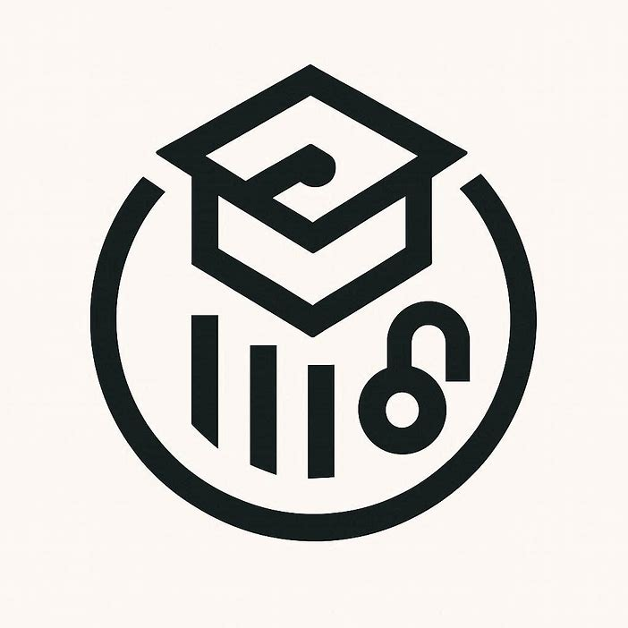

  

---

## 🚀 About Me

> Building AI-powered applications that bridge intelligent document understanding with intuitive user experiences

I'm a **Full Stack Developer** passionate about creating scalable, production-ready applications. My expertise lies in:

- 🤖 **AI Integration** - RAG systems, LLM orchestration, intelligent agents with tool approval workflows
- 🏗️ **System Architecture** - Microservices, event-driven design, distributed systems
- 🎨 **Modern Frontend** - Next.js App Router, advanced React patterns, design systems
- ⚙️ **Backend Engineering** - NestJS, FastAPI, real-time processing pipelines
- 🌐 **DevOps** - CI/CD automation, containerization, cloud infrastructure

📫 Reach me at: **lethanhtrung.trungle@gmail.com**

---

## 🔥 Featured Projects

<table>
<tr>
  <td width="50%" valign="top">
    <h3 align="center"> UniVault</h3>
    

      AI-powered document management platform with RAG-based chat, smart citation system, and intelligent course discovery. Features multi-modal LLM integration with Ollama Cloud and native tool approval workflows.
    

    

      
      
      
      
      
      
      
      
    

    
<b>Key Features:</b>

    <ul>
      <li>📄 Document ingestion with page-level citation</li>
      <li>💬 RAG-powered conversational AI</li>
      <li>🎓 Agentic course discovery & enrollment</li>
      <li>🔐 Secure asset proxying with R2</li>
    </ul>
  </td>
  <td width="50%" valign="top">
    <h3 align="center">🏨 The Haven</h3>
    

      Multi-tenant luxury booking platform with "Liquid Glass" design system, comprehensive i18n support (Vietnamese/English), and real-time availability management.
    

    

      
      
      
      
      
      
    

    
<b>Key Features:</b>

    <ul>
      <li>✨ Glassmorphism UI with luxury typography</li>
      <li>🗺️ Map-centric property search</li>
      <li>🔐 5-step registration funnel with TOTP</li>
      <li>🌍 Full bilingual support (Vi/En)</li>
    </ul>
  </td>
</tr>
<tr>
  <td width="50%" valign="top">
    <h3 align="center">📦 Orderly</h3>
    

      Modern full-stack order management system built with Turborepo monorepo architecture. Features Next.js 16 frontend and NestJS 11 backend with PostgreSQL.
    

    

      
      
      
      
      
      
      
    

    
<b>Key Features:</b>

    <ul>
      <li>🏗️ Turborepo monorepo with shared packages</li>
      <li>🎨 Tailwind CSS + Shadcn UI components</li>
      <li>🔒 JWT authentication with Zod validation</li>
      <li>📊 PostgreSQL with Prisma ORM</li>
    </ul>
  </td>
  <td width="50%" valign="top">
    <h3 align="center">🤖 Agent Skills</h3>
    

      Open-source collection of skills for AI coding agents following the AgentSkills.io format. Extends agent capabilities with packaged instructions.
    

    

      
      
      
      
    

    

      
      
    

    
<b>Key Features:</b>

    <ul>
      <li>📚 26 rules across 13 categories</li>
      <li>🔒 Security, performance, architecture patterns</li>
      <li>🧪 Testing and deployment best practices</li>
      <li>⚡ Compatible with Claude, Cursor, Gemini</li>
    </ul>
  </td>
</tr>
<tr>
  <td width="50%" valign="top">
    <h3 align="center">🏆 WDA Contest Platform 2026</h3>
    

      Full-stack contest management system for Web Development Arena 2026 with team registration, payment integration, and multi-round submission handling.
    

    

      
      
      
      
      
    

    
<b>Key Features:</b>

    <ul>
      <li>👥 Decoupled team & member management</li>
      <li>💳 PayOS payment integration</li>
      <li>📋 Multi-round submission workflow</li>
      <li>⚡ Background task scheduling</li>
    </ul>
  </td>
  <td width="50%" valign="top">
    <h3 align="center">🛒 WebDev Studios</h3>
    

      Full-stack e-commerce platform for WebDev Studios club with CQRS architecture. Sells fixed products: T-shirt, Mouse Pad, Lanyard, Keychain.
    

    

      
      
      
      
      
      
    

    
<b>Key Features:</b>

    <ul>
      <li>🏪 Complete e-commerce functionality</li>
      <li>📦 CQRS pattern for scalability</li>
      <li>💳 Payment integration</li>
      <li>🔧 Turborepo monorepo structure</li>
    </ul>
  </td>
</tr>
</table>

---

## 🛠️ Tech Stack

### Frontend

### Backend

### Database & Storage

### AI & Machine Learning

### DevOps & Tools

---

## 📊 GitHub Stats

  

  
  

  
  

---

## 📈 Contribution Graph

  

---

## 🏆 GitHub Trophies

  

---

## 🐍 Contribution Snake

  <picture>
    <source media="(prefers-color-scheme: dark)" srcset="https://raw.githubusercontent.com/xirothedev/xirothedev/output/github-snake-dark.svg" />
    <source media="(prefers-color-scheme: light)" srcset="https://raw.githubusercontent.com/xirothedev/xirothedev/output/github-snake.svg" />
    
  </picture>

---

## 📈 Current Focus

- 🔥 Advancing RAG systems with multi-modal LLM capabilities
- 🎯 Building production-ready AI agents with human-in-the-loop workflows
- 🧠 Exploring advanced prompt engineering and tool orchestration
- 🎨 Crafting premium design systems with accessibility in mind
- 📚 Contributing to open source AI/ML tooling

---

## 💬 Testimonials

<table>
<tr>
  <td width="20%" align="center">
     
    <strong>Lê Xuân Hiệp</strong> 
    CEO, Techbyte Technology
  </td>
  <td width="80%">
    <em>"Okay, for a high school student like you, this is already really good. Keep it up. You're doing much better than average. Any school will be fine for you. There's nothing to criticize."</em>
  </td>
</tr>
<tr>
  <td width="20%" align="center">
     
    <strong>Nguyen Thai An</strong> 
    Collaborator
  </td>
  <td width="80%">
    <em>"He came to me very normally. He and I worked on a project together and built a platform. Over time, he supported me a lot, gave me new ideas and technologies. On the surface, he is cold but very friendly. Sometimes I wonder why he has so much knowledge. Keep it up, boy."</em>
  </td>
</tr>
</table>

---

## 🤝 Let's Connect

  
  
  
  
  
  

  
  
  **Thanks for visiting! Let's build something amazing together 🚀**
  
  💻 Made with ❤️ by xirothedev

